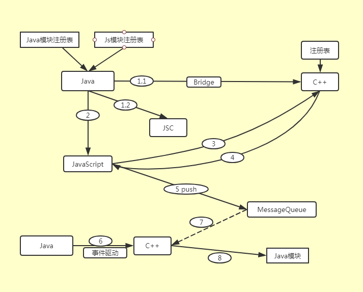
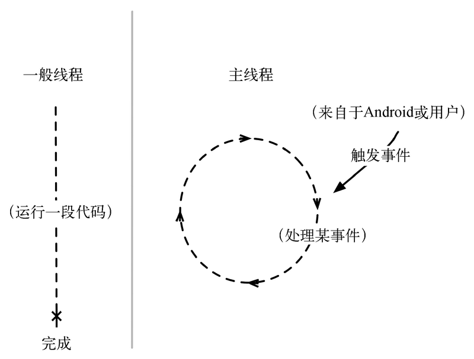
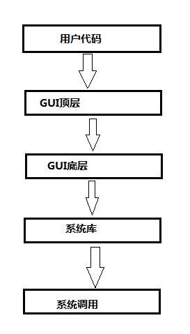
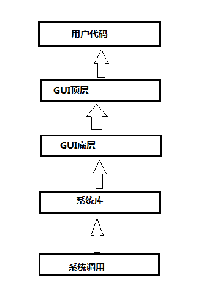
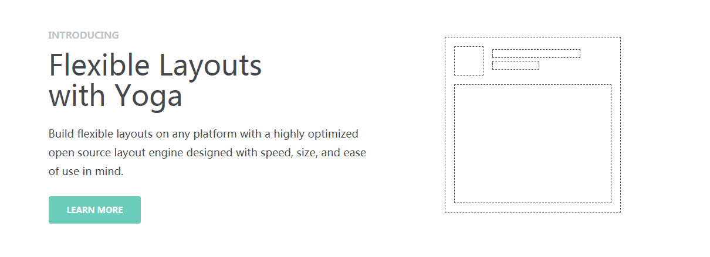
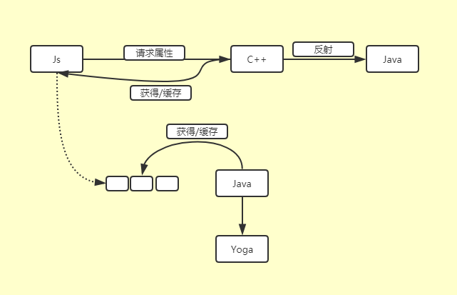

# RN Slider
标签（空格分隔）： Slider

---
# React Native 

## RN 是什么

A framework for building native apps with React.

### Native

- 性能最好,功能强大

- 多平台版本的开发、维护

- 开发周期长

- 升级困难

### Web App

- 跨平台

- 开发效率高

- 性能不好

### RN

- 性能媲美原生应用

- 开发效率高

- 跨平台

- 热更新

## 

- 通信机制

- 线程模型

- 事件驱动
 
- 渲染原理 

- 框架对比

## 通信机制

### JSC

- JavaScriptCore

- C++实现

- Apple维护

- iOS 自带

### Why not V8

- Android 版本兼容问题

- 分开实现维护问题

### Js引擎

- 浏览器内核(Trident,Webkit,blink)

- Js 引擎(Chakra,JavaScriptCore,V8)

### 基本流程 

## 线程模型

### Js 单线程模型

- Javascript 是单线程的，但浏览器是多线程的

- Js线程，GUI渲染引擎线程，HTTP 网络线程，事件轮询线程...

- 同步任务，异步任务

- 宏任务队列,微任务队列

###

- 《Multithreaded toolkits: A failed dream?》

 

### 

UI线程：即Android中的主线程，负责绘制UI以及监听用户操作。

Native线程：负责执行C++代码，该线程主要负责Java与C++的通信。

JS线程：负责解释执行JS。

## 事件驱动

### 

## 渲染原理

### Yoga

### 

## 框架对比

### WEEX

- Bundle优化
- 三端统一

### Hybrid 

- Webview + Bridge

- Cordova,PhoneGap

#### 包袱

- 布局逻辑的向前兼容

- 逻辑层和渲染层是互斥的

### 小程序

- Js执行与渲染分离
- 多 WebView
- Native View混合

### Flutter

- Dart

- Skia

### 类似框架

- JsBox Auto.Js(Rhino)

- iqiyi/LiteApp

- lynx-native

### Native 动态化

- alibaba/Tangram-Android

- Meituan-Dianping/Shield 

- alibaba/LuaViewSDK

## RN展望

- Fabric

- JS引擎抽象化

- 实现同步操作和性能优化

## 谢谢